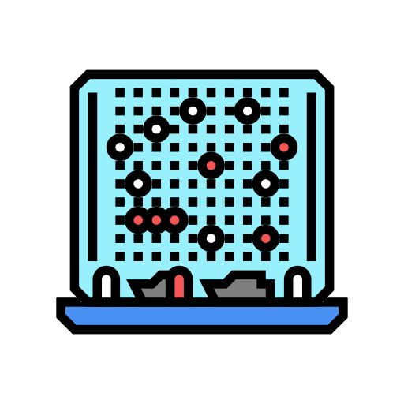

    <h1>Battleship Terminal</h1>
    
     
    <h3>"You sunk my battleship!"</h3>

  

The classic table top board game "Battleship" built entirely to run in the terminal with Rust.

<h3><u>How to play</u></h3>
The correct version of Rust and Cargo must be installed on your machine before playing. There are two ways to play after this is accomplished:
  
<ol>
1. Clone this repository and run the command "cargo run" in the root directory. This will boot up the game in whatever terminal you ran the command in.

2. Download the `battleship.exe` file from the repository and double click that. This will open your machine's default browser and begin the game.
</ol>

